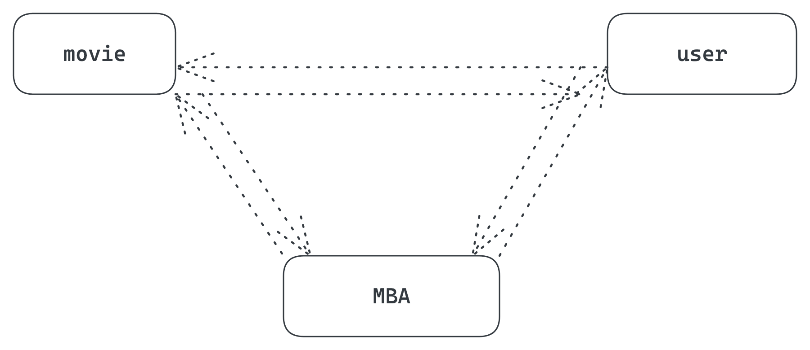

# mini project

### building stages
1. dataaccess layer
2. service layer
3. controller layer

### plan

### Movie Service

***CRUD***
1. Create a movie
2. Delete a movie
3. Fetch a movie
4. Update a movie

`all services exposed as REST`

### USer Service

***CRUD***
1. Create a new user
2. Fetch a user
3. delete a user

`all services exposed as REST`

